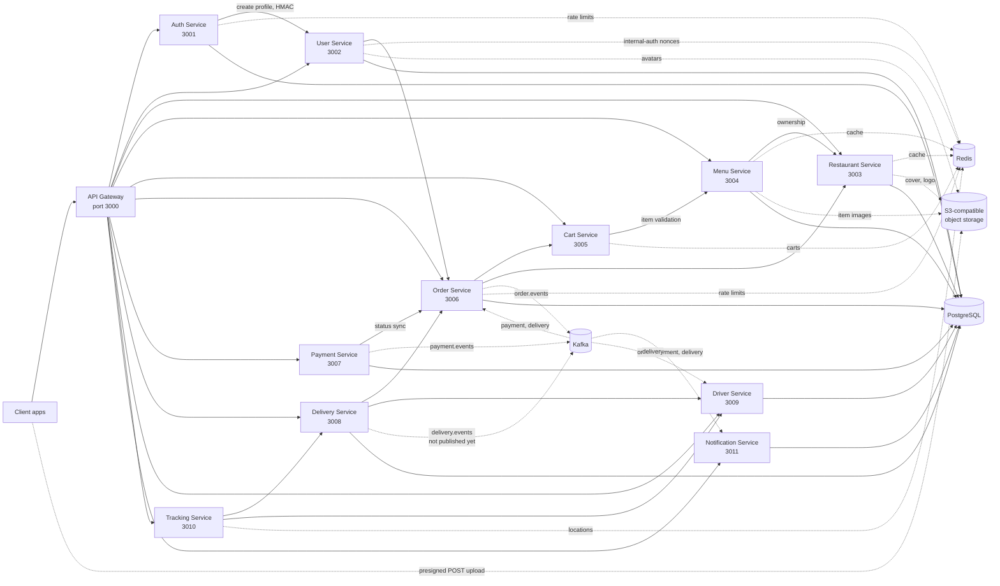

# System Architecture

## High-level architecture

## Service list

| Service              | Purpose                                            |
| -------------------- | -------------------------------------------------- |
| api-gateway          | Proxies client traffic and aggregates Swagger docs |
| auth-service         | Registers users, logs in, and issues JWTs          |
| user-service         | User profile data, avatars, order history access   |
| restaurant-service   | Restaurant CRUD, ownership checks, cover/logo      |
| menu-service         | Menu categories and items, item images             |
| cart-service         | Redis-backed cart state                            |
| order-service        | Order lifecycle and orchestration                  |
| payment-service      | Simulated payment processing                       |
| delivery-service     | Delivery workflow and driver assignment            |
| driver-service       | Driver profile and status transitions              |
| tracking-service     | Last-known driver location and delivery tracking   |
| notification-service | Notification inbox driven by Kafka events          |

## Communication model

### Synchronous

REST between the gateway and service APIs, plus service-to-service HTTP calls for lookups and status updates.

### Asynchronous

Kafka topics from the shared package drive event propagation:

* `order.events`
* `payment.events`
* `delivery.events`

Delivery-service does not publish its lifecycle events yet, and the shared consumer still deduplicates in memory; see [05-event-driven-design.md](./05-event-driven-design.md).

### Media

Clients upload image bytes directly to S3-compatible object storage with short-lived presigned POST policies issued by the owning service, then call a confirm endpoint so the service can verify the bytes and store the permanent URL. See [15-media-and-storage.md](./15-media-and-storage.md).

## Runtime

Every service is built from the root [Dockerfile](../Dockerfile) on `node:22-alpine`, selected by the `SERVICE_NAME` build argument, and runs its migrations before starting.

## Gateway routing

The gateway uses `http-proxy-middleware` and proxies routes by prefix, including:

* `/api/auth`
* `/api/users`
* `/api/restaurants`
* `/api/menus`
* `/api/cart`
* `/api/orders`
* `/api/payments`
* `/api/deliveries`
* `/api/drivers`
* `/api/tracking`
* `/api/notifications`

## Source of truth

* Gateway setup: [../services/api-gateway/src/main.ts](../services/api-gateway/src/main.ts)
* Shared Kafka topics: [../shared/src/events/topics.ts](../shared/src/events/topics.ts)
* Docker deployment: [../docker-compose.yml](../docker-compose.yml)
