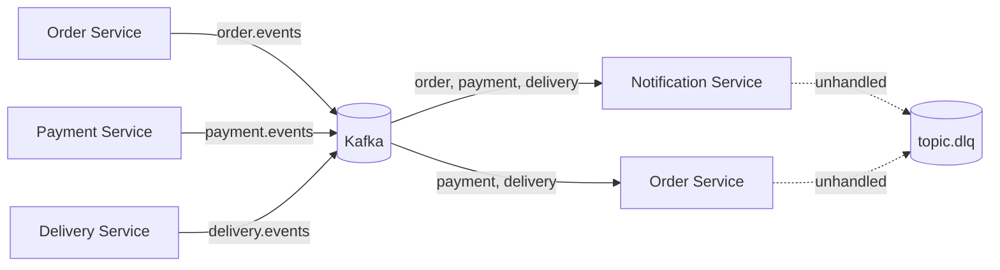

# Event-Driven Design

## Why Kafka is used here

This project uses Kafka as an asynchronous integration backbone between services. The purpose is to decouple status changes and downstream reactions from synchronous HTTP calls, but delivery is at-least-once: consumers deduplicate by `eventId` in Redis and park messages they cannot handle in a dead-letter topic.

The core event topics are declared in:

- [shared/src/events/topics.ts](../shared/src/events/topics.ts)

The current topics are:

- `order.events`
- `payment.events`
- `delivery.events`

Each has a dead-letter topic, `<topic>.dlq`, created by the consumers on startup.

## Event topology

## Topic responsibilities

### order.events

This is the primary orchestration topic. Orders emit events when the lifecycle moves across domain steps, such as:

- creation
- confirmation
- payment approval or failure
- preparation readiness
- pickup assignment
- delivery completion

The order service is the main producer of this topic. Downstream consumers can react without direct HTTP calls.

### payment.events

This topic captures payment state changes and is used to notify people or services that payment is complete, failed, or requires follow-up handling.

Typical consumers include:

- order-service for state updates
- notification-service for user notifications

Delivery semantics (payment-service):

- Events are published **after** the payment row is committed and are **at-least-once**: a retry after a failed or interrupted publish may send the same event again.
- `eventId` is deterministic: UUID v5 of `"<paymentId>:<eventType>"` in a fixed namespace (`PAYMENT_EVENT_NAMESPACE` in `payments.service.ts`). A re-published `payment.completed` for a payment always has the same `eventId`, so consumers must deduplicate by `eventId`; the shared `KafkaConsumerService` does this per consumer group in Redis (see Reliability).
- Each payment emits at most one event per type in normal operation; `publishedEventStatus` on the payment row tracks what was already published.
- The payload shape `{ paymentId, orderId, amount, status }` and event type names are unchanged; `eventId` remains a UUID, so existing consumers are unaffected.
- The order-service status update is a separate HTTP call, not driven by the event; it is tracked the same way (`orderSyncedStatus`) and retried by the client's next `process`/create retry, not by Kafka.
- payment-service owns the payment → order transition (`PENDING` → `PAYMENT_PENDING`, `COMPLETED` → `CONFIRMED`, `FAILED` → `FAILED`). order-service's payment-event consumers apply the **same** statuses as a convergence path (`syncStatusFromEvent`): a same-status update is a no-op, and a stale or late event (e.g. `payment.failed` after the customer cancelled) is logged and skipped rather than retried. If the HTTP sync of a `FAILED` payment hits an order that is already terminal, payment-service marks it synced; a `COMPLETED` payment on a closed order still errors (needs a refund).
- order-service publishes `order.payment_pending` and `order.failed` for those transitions (added in Phase 0; they were previously mislabeled `order.created`).
- Order status writes are compare-and-set (`UPDATE … WHERE status = <expected>`): when the HTTP sync and the consumer race to the same status only the winner publishes, so `order.confirmed` (and its notification) is emitted once.

### Partitioning, event ids and topic provisioning

- The shared producer keys every message by the payload's `orderId` (`eventPartitionKey`), falling back to the `correlationId` for events without one. All order, payment and delivery events of one order land on the same partition in publish order, so partitions can be added without breaking per-order ordering.
- Order and delivery events use `lifecycleEventId(entityId, eventType)`: UUID v5 of `"<id>:<eventType>"`, stable because both lifecycles are one-way (each event type happens at most once per entity). Payment keeps its own namespace (`paymentEventId`).
- `KafkaConsumerService.subscribe` creates the topic and its `.dlq` first (idempotent, waits for a leader). Before this, a consumer subscribing to a topic nobody had produced to yet crashed on a fresh cluster. kafkajs logs `Topic creation errors` at ERROR level when the topics already exist; that line is expected.
- Topics are created with broker defaults (1 partition locally). Production needs explicit partition and replication settings.

### delivery.events

delivery-service publishes one event per lifecycle transition: `delivery.created`, `delivery.driver_assigned`, `delivery.picked_up`, `delivery.in_transit`, `delivery.completed`, `delivery.cancelled`, with `{ deliveryId, orderId, driverId?, status }`.

- Staged in the transactional outbox together with the delivery write (#98) and published by the relay; the HTTP syncs to order-service (order status) and driver-service (availability) run after the commit. Because the event is committed with the write, order-service converges from it even when the HTTP order sync fails. Delivery actions are retry-safe: repeating an action on a delivery already in the target status re-runs the syncs (its event was already staged with the original write, same `eventId`), so a failed driver release is repaired by the client's retry (see [docs/services/delivery-service.md](../docs/services/delivery-service.md#retry-safety)). Verified live: with order-service down, `complete` failed after releasing the driver; the retry delivered the order and re-published `delivery.completed` with the same id.
- order-service applies `driver_assigned`, `picked_up` and `completed` through `syncStatusFromEvent` (same status → no-op; stale → logged and skipped), so a late or redelivered event never fails the consumer.
- driver-service does **not** consume delivery events. Its old release-on-completion consumer was removed: a late `delivery.completed` could free a driver already on the next delivery, and AVAILABLE → AVAILABLE is not a valid transition.
- Delivery events carry the order's `customerId` (stored on the delivery at creation, #5). notification-service notifies on `driver_assigned`, `picked_up` and `completed`.

## Event-driven patterns in the repository

### 1. Command and notification separation

Service APIs handle immediate command requests, while Kafka is used for background propagation of events.

Example pattern:

- user places order via gateway
- order-service validates and persists order
- order-service publishes an order lifecycle event
- other services react asynchronously

### 2. Persistence + projection model

The system keeps authoritative state in each service’s database, while Kafka events act as integration messages. This is a classic event-driven microservice pattern rather than a distributed transaction design.

The repository does not implement a centralized event store. Instead, each service persists its own domain truth and listens for only the events that matter to it.

### 3. Event consumer responsibilities

Services react to incoming events by updating their own internal state or creating follow-up side effects:

- `notification-service` subscribes to order/payment/delivery topics and notifies the customer on `payment.completed`, `order.confirmed`, `delivery.driver_assigned`, `delivery.picked_up` and `delivery.completed` (#5). Events without `customerId` are skipped, never guessed
- `order-service` converges its status from payment and delivery events (tolerant of duplicates and stale events)
- `delivery-service` consumes `order.ready_for_pickup` and dispatches automatically: it creates the delivery if none exists and assigns a driver. With no driver free, the delivery waits and a periodic sweep retries; the event is not dead-lettered. Durable idempotency is used, and races with manual dispatch end in one delivery and one driver (see [docs/services/delivery-service.md](../docs/services/delivery-service.md#automatic-dispatch))
- `driver-service` consumes nothing; availability is set synchronously by delivery-service (compare-and-set claim and release; a BUSY driver cannot make themselves AVAILABLE)
- `tracking-service` consumes nothing either. Its lifecycle (#32) is derived at read time from the delivery's current status and driver over HTTP, not from `delivery.events`. A delivered or cancelled delivery reads as `ENDED` with no position, and a reassignment switches to the new driver's position. Positions expire through the Redis TTL. See [docs/services/tracking-service.md](../docs/services/tracking-service.md#delivery-tracking-lifecycle)

## Why this matters for maintainers

A key design principle in this repo is:

- the service database owns the current truth
- Kafka carries the change signal
- each consumer decides how to react

This avoids a single shared database but still allows loosely coupled coordination across services.

## Current implementation status

The repo contains an explicit Kafka topic registry and event-driven service relationships, but the event payload schema is still lightweight and mostly code-structure-driven rather than a fully mature contract registry.

Most of the actual event contracts are established implicitly through:

- shared topic names
- service-specific event listeners
- message content created by each producer

This means the project is best understood as a practical microservice event bus rather than a strict event-sourcing system.

### Reliability (shared `KafkaConsumerService`)

Per message, in order:

1. Unparseable (not JSON, or no `eventId`/`eventType`) → sent to `<topic>.dlq` with reason `unparseable`, offset committed.
2. No handler in this group for the event type → offset committed.
3. **Claim** the event in Redis via `DurableEventIdempotencyService.tryAcquire(groupId, eventId)`. `processed` → skip and commit. `in-progress` (another consumer mid-handler after a rebalance) → poll until it finishes or its lease expires (the partition stays blocked, preserving order), then give the message back to kafkajs.
4. Run the handler, up to `maxHandlerAttempts` attempts (default 3) with exponential backoff (200 ms, 400 ms, …).
5. Success → `markProcessed`, then commit. Exhausted → send to `<topic>.dlq` with reason `handler-failed` and the error, **release** the claim (not marked processed, so a replay can run it), then commit.

The offset is only committed once the event is handled, already handled, or safely in the dead-letter topic. If Redis or the dead-letter send fails, the error propagates and kafkajs redelivers the message.

Dead-lettered messages keep their key, value and headers, plus `dlq-original-topic`, `dlq-original-partition`, `dlq-original-offset`, `dlq-consumer-group`, `dlq-reason`, `dlq-error` and `dlq-failed-at`.

**Replay:** `npm run kafka:dlq -- <topic>` lists what is pending; `--replay` republishes each message to its original topic (dead-letter headers stripped). Every group sees it again; groups that already handled it skip it through durable idempotency. Progress is tracked by the `delivery-plus-dlq-replay` consumer group, so each message is replayed once. Unparseable messages are listed and skipped. `KAFKA_BROKER` defaults to `localhost:9092`.

**Durable idempotency** (`DurableEventIdempotencyService`): Redis keys `kafka:idempotency:{consumerGroup}:{eventId}` holding `lease:<token>` while a consumer handles the event (60 s TTL) or `processed` (7 days, matching Kafka's default retention). Every operation is one Lua script. order-service, notification-service and delivery-service use it (`KafkaModule.register({ durableIdempotency: true })` plus `RedisModule`). A consumer registered without it falls back to an in-process set and logs a warning at startup.

**Redis persistence:** the Compose Redis runs with AOF (`--appendonly yes`) on the `redis_data` volume, so processed markers (and carts) survive a Redis restart.

Verified live (2026-10-01, dev stack):
- All events of one order carried the `orderId` as key.
- Rewinding notification-service's offsets and restarting it redelivered 6 events; all 6 were skipped as processed, with no duplicate notifications.
- A handler failure (notifications table renamed) and a poison message both reached `order.events.dlq`. After restoring the table, `--replay` created the notification exactly once and skipped the poison message; a second replay found nothing pending.

### Transactional outbox (#98)

order-service and delivery-service no longer publish from the request path. Each state change and the event describing it are written in **one database transaction**: the order insert or status compare-and-set, or the delivery insert or transition, plus a row in that service's `outbox_events` table (`stageEvent`). `OutboxRelay` (shared, one per service) publishes unpublished rows in insertion order and marks them published.

- **Guarantee:** an event is published if and only if its state change committed, even if the service crashes right after the commit or Kafka is down. The write path kicks the relay after the commit, so latency stays as before; otherwise it polls every `OUTBOX_RELAY_INTERVAL_MS` (500 ms).
- **At-least-once:** a crash after Kafka accepted a message but before the row was marked re-sends it. This is safe because event ids are deterministic and consumers deduplicate them. Staging the same event again (e.g. a retried action) is a no-op (`ON CONFLICT (event_id) DO NOTHING`).
- **Order and concurrency:** a batch stops at the first failed publish (recorded as `attempts`/`last_error`) and is retried, so a later event for an order never overtakes an earlier one. A Postgres advisory lock (`pg_try_advisory_xact_lock`) lets one relay per database work at a time, so several instances neither double-publish nor reorder.
- **Verified live** on the E2E stack, 9/9 checks:
  1. With Kafka stopped, `READY_FOR_PICKUP` still succeeded and its event was staged.
  2. order-service was killed before publishing; no delivery existed.
  3. After Kafka and order-service restarted, the relay published the event and auto-dispatch created exactly one delivery.
  4. No new dead letters, no rows left unpublished; the order reached DELIVERED.
- payment-service keeps its status-marker re-publish approach.

### Driver release reconciliation (#98)

`DriverReconciliationService` (delivery-service) releases drivers left BUSY after their delivery finished. It sweeps every `DRIVER_RECONCILE_SWEEP_MS` (60 s; 3 s on the E2E stack) over the drivers of deliveries DELIVERED or CANCELLED in the last 24 h. It releases a driver only when all of these hold:
- they have no active delivery;
- driver-service still reports BUSY;
- their status has not changed for `DRIVER_RECONCILE_GRACE_MS` (60 s; 5 s on E2E).

The grace period protects an assignment in progress: claiming a driver changes their status. A stuck BUSY driver cannot be claimed (claims need AVAILABLE), so the check and the release don't race a new assignment.

**Verified live, 10/10:**
1. A row lock let `complete` commit DELIVERED while the release blocked. delivery-service was stopped and the waiting release statement was killed.
2. The driver was BUSY with no active delivery, and still BUSY 8 s later.
3. After delivery-service restarted, with no client retry, the sweep released the driver, and the order was DELIVERED from the committed event.
4. One delivery, no dead letters.

### Remaining gaps

- **Driver release is reconciled by a sweep, not by events.** driver-service still consumes no delivery events. A `complete`/`cancel` whose driver release fails and is never retried is repaired by delivery-service's `DriverReconciliationService` (see below).
- **Payloads:** payment and delivery events carry an optional `customerId` (#5); events published before it, or for deliveries created before migration 004, have none and are not notified.
- **Handler time:** kafkajs heartbeats only between messages (session timeout 30 s). Handlers must stay well below that and the 60 s lease, or the lease needs renewal.
- **No graceful shutdown hooks:** a stopped service stays in its consumer group until the session times out.
- **No schema registry or runtime validation** of payloads beyond `eventId`/`eventType`.

## Source of truth

For exact topic names, see:

- [shared/src/events/topics.ts](../shared/src/events/topics.ts)

For service-level wiring and relationship assumptions, see:

- [docs/services/order-service.md](../docs/services/order-service.md)
- [docs/services/payment-service.md](../docs/services/payment-service.md)
- [docs/services/delivery-service.md](../docs/services/delivery-service.md)
- [docs/services/notification-service.md](../docs/services/notification-service.md)
- [docs/services/driver-service.md](../docs/services/driver-service.md)
